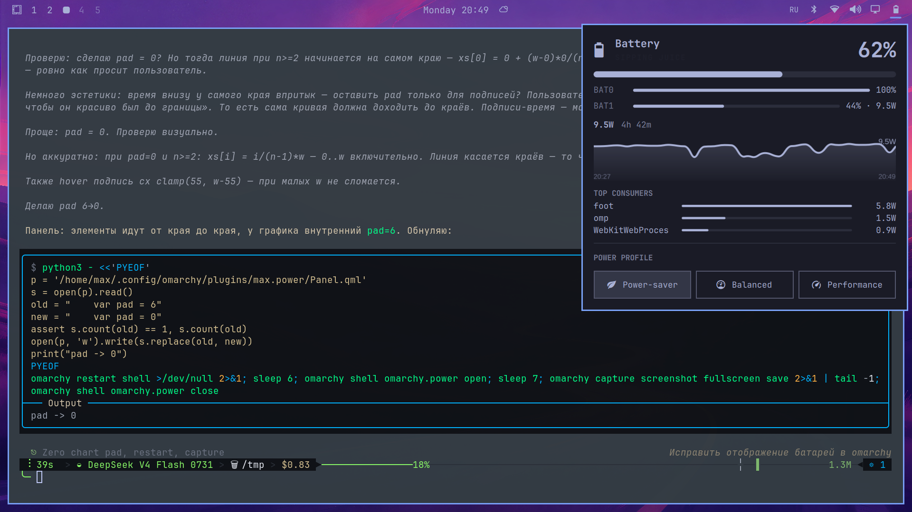

# Cellmate

[](LICENSE)

Multi-battery widget for the [Omarchy](https://omarchy.org/) shell.
One widget for every battery in your laptop: totals, per-cell draw, a live
wattage history chart, and the top power consumers — no root required.



## Features

- **Per-battery rows** — each installed battery with its own percentage and
  signed draw (`BAT1 45% · 9.8W`), bars normalized to full charge.
- **Totals at a glance** — combined percentage, draw and time-left estimated
  from a 10-minute trailing average (so CPU bursts don't jiggle the ETA).
- **Wattage history chart** — 30s samples persisted to
  `~/.local/state/omarchy/power-history.log` (2-day cap), so the graph survives
  shell restarts. Hover for a crosshair readout; simple, no clutter.
- **Top energy consumers** — real current CPU share measured over a 1s window
  (`ps pcpu` is a lifetime average and lies), attributed to the measured
  battery draw: `foot 6.7W · omp 1.2W · …` On AC there is no measurable total,
  so CPU share is shown instead.
- **Power profile switcher** — the standard Omarchy profiles, inline.

## Install

```sh
omarchy plugin add https://github.com/oxyplay/omarchy-cellmate.git --enable
```

Then move the widget to the bar's right section (it is a bar widget):

```sh
omarchy bar move io.github.oxyplay.cellmate --section right
```

## Remove

```sh
omarchy plugin remove io.github.oxyplay.cellmate
```

Works with any number of batteries (0 hides the widget, 1 behaves like a
classic battery icon).

## Why "battery draw split by CPU"?

Linux exposes no per-process wattmeter without root (RAPL counters are
root-only). Cellmate measures the *real* total draw from UPower and attributes
it proportionally to each process's freshly measured CPU share. It is an
estimate — screen, radio and other fixed loads get folded into the same pie —
but the numbers are watts, always sum near the measured draw, and react to
real load changes.

## Layout

- `Panel.qml` — the widget (aggregation, chart, consumers, UI)
- `Model.js` — pure helpers (icons, labels, formatting)
- `topconsumers.sh` — CPU-share sampler (embedded into `Panel.qml` as base64;
  regenerate with `base64 -w0 topconsumers.sh`)
- `manifest.json` — Omarchy plugin manifest

## Origin

Cellmate is a derivative of the Omarchy shell power panel
([`omarchy.power`](https://github.com/basecamp/omarchy)) — the upstream project
is by the [Omarchy contributors](https://omarchy.org/), released under MIT.
It was extended with multi-battery aggregation, a persisted wattage history
chart, and per-process energy attribution. See `NOTICE` for details.

## License

MIT — see [LICENSE](LICENSE). Upstream copyright of the Omarchy contributors
applies to the derived base code.